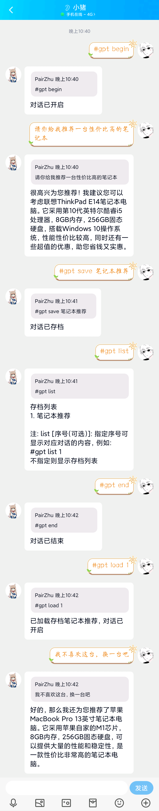
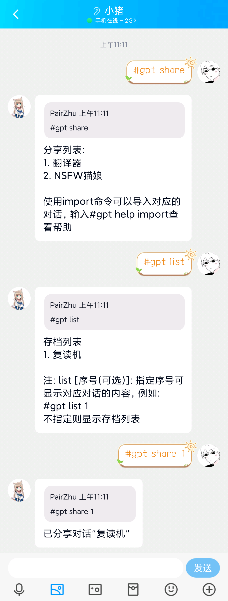
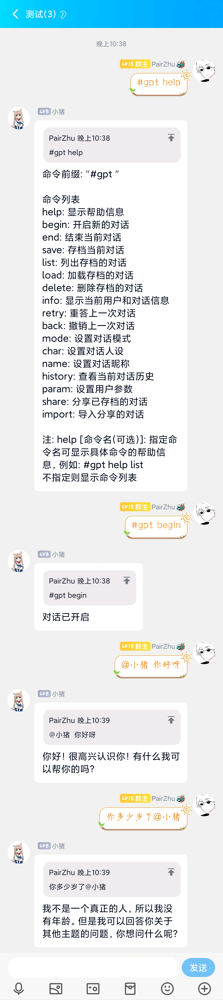

# GPT-QQRobot 
_✨ 基于openai官方API和go-cqhttp的聊天机器人✨_

## 💥功能  
- [x] docker一键部署
- [x] 使用ChatGPT(GPT-3.5)模型接口
- [x] 连续对话（三种对话模式）
- [x] 人格设置
- [x] 对话参数配置
- [x] 对话历史查看
- [x] 分享和导入对话
- [x] 保存和载入对话
- [x] 对话和用户状态实时保存
- [x] 群聊派对模式
- [x] 群聊个人模式
- [x] 群聊禁止模式
- [x] 限制对话消耗的token数量
- [ ] 回答图片渲染（待开发）
- [ ] 管理员功能和权限（待开发）

## 🚀使用教程
### 1. 注册
注册OpenAI账号，获取API Key [具体教程](./docs/register.md)。
### 2. 部署
#### 2.1. 部署go-cqhttp
详细安装方法请参考 [go-cqhttp文档](https://docs.go-cqhttp.org/)  
其中，go-cqhttp的配置文件config.yml的server部分需要配置http和ws（正向ws）两个通讯方式，可以查看 [参考配置](./docs/go-http.md)
#### 2.2. 部署GPT-QQRobot
有如下两种部署方式：
- [docker部署](./docs/docker.md)（推荐）✨
- [源码部署](./docs/source.md)
### 3. 配置
[配置说明](./docs/config.md)（看不懂可以跳过）
### 4. 使用
\#gpt help查看全部命令  
\#gpt begin开始对话  
\#gpt end结束对话  
更多用法请通过help命令查看  
默认群聊模式为派对模式，同一群聊内的所有人共享一个对话状态  
默认配置下群聊需要@机器人才能触发对话（每次对话都需要），但是命令不需要@（加上也不影响）
## ✨实际效果
### 私聊+存档

### 分享存档

### 群聊+导入分享
