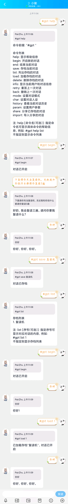
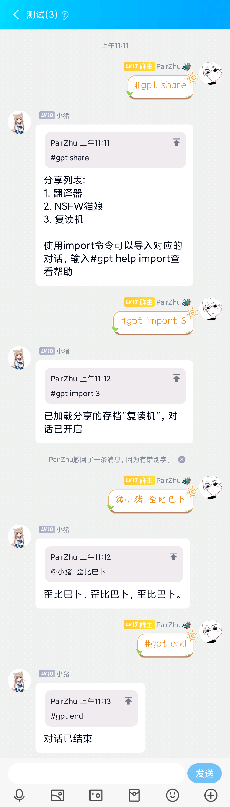

# GPT-QQRobot 
_✨ 基于openai官方API和go-cqhttp的聊天机器人✨_

## 💥功能  
- [x] docker一键部署
- [x] 使用ChatGPT(GPT-3.5)模型接口
- [x] 连续对话（三种对话模式）
- [x] 人格设置
- [x] 对话参数配置
- [x] 对话历史查看
- [x] 分享和导入对话
- [x] 保存和载入对话
- [x] 对话和用户状态实时保存
- [x] 群聊派对/个人/禁止模式
- [x] 自带代理配置
- [x] 限制对话消耗的token数量
- [x] AI图片生成
- [ ] 回答图片渲染（待开发）
- [ ] 管理员功能和权限（待开发）

## 变更日志
- [2023/3/7 20:00] 发现文档里给的第三方接口已失效，目前不知道有没有其他的第三方接口，如果有的话可以在issue里提出来，我会更新文档
- [2023/3/8 12:00] 发现文档里给的已经恢复，并更新了新的第三方接口
- [2023/3/8 16:00] 2023年3月8日13:00到16:00之间下载的源码有严重bug：群聊无法回复消息，如果这个期间下载的源码的请重新拉取新的源码
- [2023/3/9 23:25] 优化了和CQ-HTTP的连接，不再需要http通讯方式，只需要ws（正向ws）即可，优化了消息分片算法，和消息排序算法
- [2023/3/10 19:00] 修改配置名称 DEFAULT_MAX_TOKENS为MAX_TOKENS，DEFAULT_MAX_PROMPTS为MAX_PROMPTS，DEFAULT_MAX_USER_CACHE改为MAX_USER_CACHE，增加AI图片功能
## 🚀使用教程
### 1. 注册
注册OpenAI账号，获取API Key [具体教程](./docs/register.md)。
### 2. 部署
#### 2.1. 部署go-cqhttp
详细安装方法请参考 [go-cqhttp文档](https://docs.go-cqhttp.org/)  
其中，go-cqhttp的配置文件config.yml的server部分需要配置http和ws（正向ws）两个通讯方式，可以查看 [参考配置](./docs/go-http.md)
__不会配置的请使用参考配置！！！__
#### 2.2. 部署GPT-QQRobot
有如下两种部署方式（仅对linux用户推荐，windows用户请看最下面的常见问题）：
- [docker部署](./docs/docker.md)（推荐）✨
- [源码部署](./docs/source.md)
### 3. 配置
[配置说明](./docs/config.md)（看不懂可以跳过）
### 4. 使用
\#gpt help查看全部命令  
\#gpt begin开始对话  
\#gpt end结束对话  
更多用法请通过help命令查看  
默认群聊模式为派对模式，同一群聊内的所有人共享一个对话状态  
默认配置下群聊需要@机器人才能触发对话（每次对话都需要），但是命令不需要@（加上也不影响）
## ✨实际效果
### 视频演示

### 私聊+存档

### 分享存档

### 群聊+导入分享

## 📝常见问题
### 1. 为什么我和机器人聊天没有任何反应？
默认的配置是某个用户要和机器人聊天，需要先发送\#gpt begin命令之后，然后才能和机器人聊天，如果不想聊天的时候发送\#gpt end命令，这样机器人就不会回复你的聊天了
### 2. 为什么我在群聊里开启了聊天之后发消息机器人不回复？
默认的配置是需要在群聊里@机器人才能触发对话，如果没有@机器人，机器人不会回复任何消息，配置方法请参考上面给的配置说明  
如果已经@机器人了还是不回复，可能是你用的api或者代理响应速度比较慢，先等半分钟，如果机器人还是不回复，那么可能是因为你的消息含有敏感词被tx吞了。  
如果cqhttp日志显示发送成功或者发送失败（总之有发送记录），那么大概率就是被风控了，只能换号了，一般账号被风控了电脑或者手机挂着在线一段时间就可以恢复了。

### 3. 我API_KEY都是正确的，也还有余额，但是控制台还是提示我API_KEY错误，或者机器人回复“出错了，请稍后再试，或联系管理员”
这个问题可能是因为你没配置可用的第三方接口，并且没正确地配置代理，可以在参考配置文档里的代理地址选项，且确保你的代理规则命中了openai.com的域名

### 4. CQ-HTTP 死活登不上
可以尝试把CQ-HTTP的device.json里的"protocol":5改成"protocol":2，如果还是不行，你只能转向go-cqhttp的文档了，不是本项目的问题

### 5. CQ-HTTP 登上了，但是连不上
请确保你URL配置正确，尤其是环境变量的等号前后不能有空格
也可能是因为你再windows下部署，然而go-cqhttp直接在windows下运行，机器人又在Docker里部署的。因为windows下面的Docker是在WSL里运行的，所以会涉及到wsl和windows通讯的问题，建议go-cqhttp也在wsl下部署就可以了。
如果用windows部署，你对wsl和网络没有基础了解的话，不建议使用docker部署，建议用源码部署并照抄推荐的配置文件  
如果是linux用户，我相信你有自己解决问题的能力

