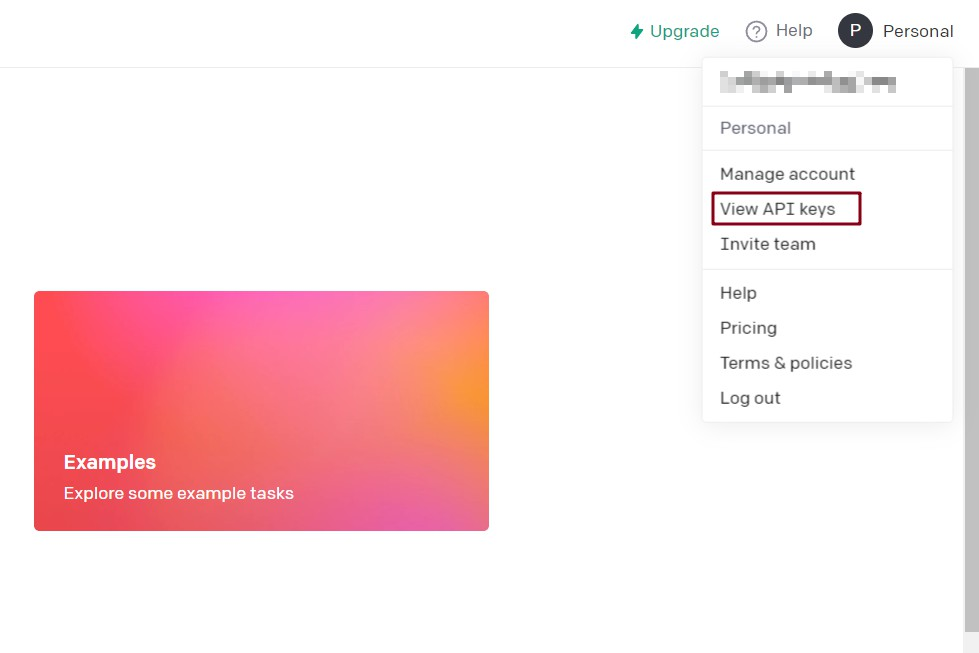
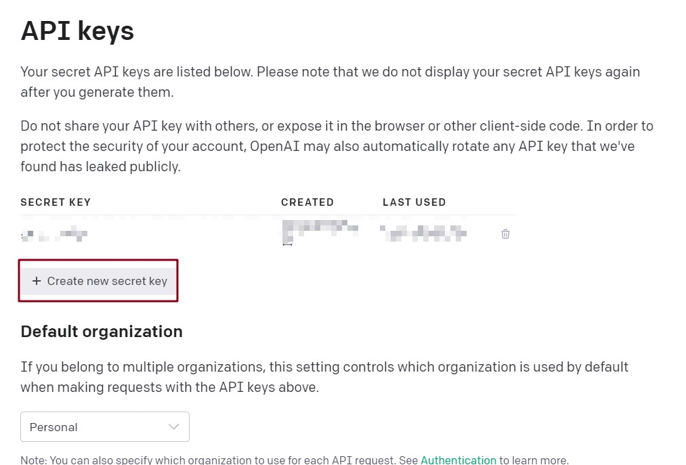
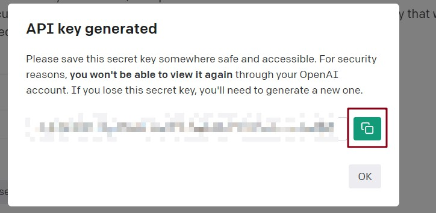

# OpenAI账号注册以及API Key获取
## 1. 注册OpenAI账号
进入<https://platform.openai.com/>，选择signup注册。目前openai不对包括俄罗斯、乌克兰、伊朗、中国等国家和地区提供服务，所以部分用户需要通过魔法上网（部分机房ip的梯子也无法使用）的手段来使用其他国家和地区的ip登录，如果依然提示OpenAI's services are not available in your country. 则需要清空cookie等网页缓存并且退出浏览器的用户账号刷新后重试。  
此外，注册需要验证所在国家和地区的手机号码（似乎不支持虚拟手机号），如果没有国外手机号可以试试解码网站，收费的推荐<https://sms-activate.org/>。
## 2. 获取API Key
1. 登录完成后点击右上角的头像，然后选择"View API keys"  

2. 点击按钮"Create new secret key"  

3. 在弹出的窗口中点击复制的图标，一定要复制然后保存下来，因为key只会出现一次(不过丢了重新创建就是了，也不是什么麻烦事)  

## 3. 补充
OpenAI的API是收费的，但是目前每个账号都有18美元的体验金，可以用挺久的，但是所有体验金都会在4月1日过期，自己充值必须要有外国的银行卡，所以不要吝啬，尽快使用。可以多注册几个账号，每个账号都有18美元的体验金，本项目做了多API Key的支持。